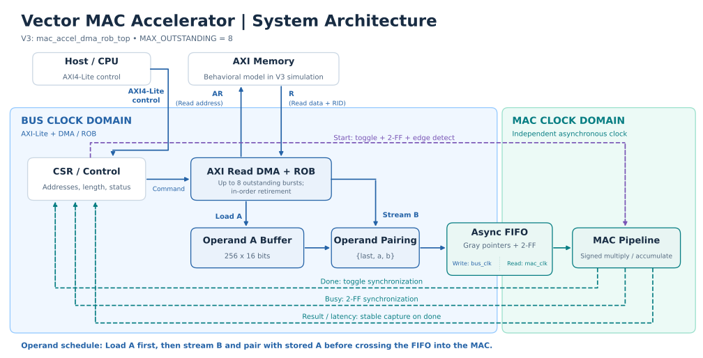
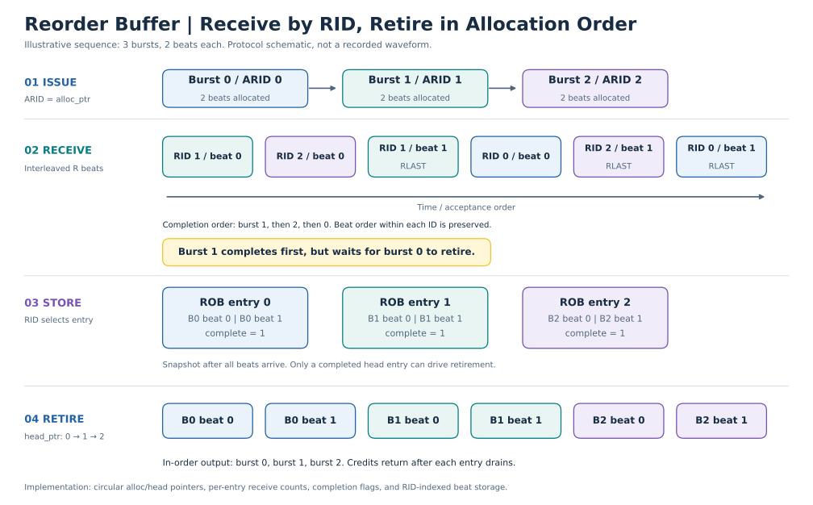

# Vector MAC Accelerator with CDC and Multi-Outstanding AXI Read DMA

A parameterized Verilog dot-product accelerator with AXI4-Lite control,
independent bus/MAC clocks, and an AXI read DMA. The current V3 design keeps up
to eight read bursts in flight and uses a RID-indexed reorder buffer (ROB) to
accept out-of-order/interleaved responses while delivering operands in order.

## Results at a glance

| Contribution | Result | Conditions and scope |
|---|---|---|
| Operand delivery | **Simulated MAC-feed utilization: 6.78% → 27.21% (4.0×)** | 256 elements/vector, 16-beat bursts, 100-cycle first-beat memory latency; V2 with 1 vs. V3 with 8 outstanding bursts |
| Timing optimization | **Synthesized QoR critical-path length reduced by 26.36%** | 5.50 → 4.05 ns; DMA block, depth 8, same 100 MHz synthesis configuration |
| Targeted clock gating | **Active dynamic power reduced by 53.59%** | 76.1114 → 35.3225 mW; DMA block, identical workload activity, SAIF-driven pre-layout estimate |

Verification combines RTL scoreboards, formal control-safety properties,
dual-clock CDC regressions, and whole-top DC/PrimeTime timing analysis.
V1 was also validated on a Digilent Nexys A7-100T with MicroBlaze; V2/V3 use
behavioral AXI memory models.

## Architecture

| Version | Top module | Operand delivery |
|---|---|---|
| V1 — CPU-fed | `mac_accel_axi` | CPU writes operands through AXI4-Lite |
| V2 — DMA | `mac_accel_dma_top` | Single-outstanding AXI read DMA |
| V3 — ROB DMA | `mac_accel_dma_rob_top` | Multiple unique-ID bursts with in-order ROB retirement |



V3 first fetches vector A into `buf_a`, then streams vector B and pairs it with
stored A. Each `{last,a,b}` pair crosses the asynchronous FIFO into the signed
multiply/accumulate pipeline. AXI-Lite registers provide addresses, length,
start/status, result, and latency.

### Out-of-order receive, in-order output

Each accepted AR request uses `ARID=alloc_ptr`. Incoming R beats select their
ROB entry by `RID`; only the completed `head_ptr` entry may retire. An entry's
credit returns after all its beats have drained, preventing premature ID reuse.



*Illustrative two-beat bursts, not a recorded waveform. Beat order within each
ID is preserved. Burst 1 completes first but waits for burst 0 to retire.*

### Clock-domain crossing

| Signal | Direction | Method |
|---|---|---|
| Start event | bus → MAC | Toggle, 2-FF synchronization, edge detection |
| Operand stream | bus → MAC | Async FIFO with Gray-code pointers |
| Done event | MAC → bus | Toggle, 2-FF synchronization, edge detection |
| Busy level | MAC → bus | 2-FF synchronizer |
| Result/latency | MAC → bus | Stable bus captured when synchronized done arrives |

See the [RTL module map and register interface](rtl/README.md) for integration
details. The complete accelerator is `mac_accel_dma_rob_top`; the timing/power
benchmark below targets `mac_dma_rob`, excluding the AXI-Lite shell, FIFO and MAC.

## Performance and optimization

**Hide memory latency with multiple outstanding reads.** V2 waits for each
burst before issuing the next; V3 overlaps requests and restores response order
through the ROB. Under the utilization-test conditions above, accepted operand
pairs per DMA-busy bus cycle increase from 256/3777 to 256/941. This is a 4.0×
increase in simulated MAC-feed utilization, not a 4.0× whole-accelerator speedup
or a measurement of MAC PE activity. See the [measurement definition and
testbenches](sim/README.md#utilization-measurement).

**Shorten address-generation logic.** Replacing
`cmd_addr_r + (issue_elem << 2)` with handshake-updated `current_ar_addr_r`
reduces synthesized QoR critical-path length from 5.50 to 4.05 ns. These compare
each design's global worst path, not the delay of one unchanged path. The
optimized 100 MHz block has setup WNS +4.7923 ns. A 100–200 MHz synthesis sweep
passes setup, but the 200 MHz point has only +0.0389 ns margin and exposes the
flat ROB read/capture path. The canonical target remains 100 MHz.
See [timing comparison](syn/README.md#first-synthesis-driven-optimization) and
[frequency characterization](syn/README.md#clock-period-sweep).

**Stop unnecessary A-buffer clock activity.** Power Compiler gates only the
4096 `buf_a` register bits in 256 16-bit banks; all other registers, including
CDC logic, are excluded. Baseline and gated designs consume identical active
and idle SAIF files from a deterministic workload: 40-cycle memory latency,
OOO responses/backpressure, a length-64 active job, and a 512-cycle idle window.
Active dynamic power falls by 53.59%, idle dynamic power by 57.22%, and estimated
energy per job from 221.870 to 102.970 nJ. Gated setup WNS is +2.4278 ns at 100 MHz.
The OSU library uses discrete LATCH + AND cells rather than a dedicated ICG.
See [power methodology, coverage and results](syn/README.md#targeted-buf_a-clock-gating-experiment).

Block timing/power results use `mac_dma_rob`, `MAX_OUTSTANDING=8`, Design Compiler
R-2020.09-SP4 and `osu018_stdcells.db`, with a 10 ns clock target. They are
pre-layout estimates using ideal clocks, without CTS or extracted parasitics.

## Verification

| Evidence | What is checked | Recorded result |
|---|---|---|
| RTL regressions | AR geometry/stability, request/beat conservation, RID placement, ordered output, payload/last under stalls | ROB 12/12, DMA wrapper 11/11, V3 full top 7/7; power workload 4/4 |
| Supplemental CDC matrix | Six clock/phase/reset-release scenarios, six consecutive jobs per scenario, operand/event/Gray-pointer checks | 36/36 jobs per simulator with Icarus and VCS; eight outstanding bursts observed on long jobs |
| Formal | DMA backpressure safety, FIFO Gray/overflow/underflow properties, ROB ownership/order/count/error properties | BMC + prove PASS; ROB IC3/PDR prove and cover PASS |
| Whole-top DC + PrimeTime | Mapped dual-clock timing and CDC connectivity, including all 13 two-flop chains | Bus/MAC setup and hold: 0 violations |

The whole-top timing flow uses `mac_accel_dma_rob_top`, depth 8, asynchronous
ideal clocks at bus 10 ns / MAC 7.5 ns, and functional I/O min 0/max 1 ns.
Worst setup slack is +5.114273 ns (bus) and +0.020727 ns (MAC); worst hold slack
is +0.049906 ns and +0.214744 ns respectively. The small MAC setup margin is
20.727 ps in a single-corner pre-layout model.

Detailed evidence: [simulation map and checks](sim/README.md#regression-evidence),
[CDC scenario matrix](sim/CDC_REGRESSION.md), [formal properties and assumptions](formal/STUDY_GUIDE.md),
and [whole-top DC/PT results and coverage](syn/whole_top/RESULTS.md).
The ROB proof uses a small bounded parameter configuration and legal AXI slave
assumptions; its proven scope is control safety within that model.

## Design scope and limitations

- The AXI master implements the read-only AR/R subset; behavioral/formal memory
  models stand in for a commercial memory subsystem. Bursts are not split at
  4 KB boundaries, so callers must keep each burst within a page.
- Timing and SAIF power results are pre-layout portfolio evidence. Physical
  closure, multi-corner timing, CDC/RDC signoff and signoff power are not established;
  reset timing exclusions and coverage limits are documented in the whole-top flow.
- Mapped GLS remains inconclusive due to OSU cell-model unknown-state behavior,
  also reproduced by the baseline. LEC is not established. The library assigns
  zero area to its generic latch, so the gating area delta is not a credible result.
- V3 defaults to outstanding depth 4; published depth-8 results select
  `MAX_OUTSTANDING=8` explicitly.

## Quick start

With Icarus Verilog installed, run from the repository root:

```bash
# V3 full top: AXI-Lite → DMA/ROB → async FIFO → MAC → result CSR
iverilog -g2012 -DV3_MAX_OUT=8 -s tb_mac_accel_dma_rob_top \
  -o /tmp/mac_accel_dma_rob_top \
  sim/tb_mac_accel_dma_rob_top.v rtl/mac_accel_dma_rob_top.v \
  rtl/mac_dma_rob.v rtl/axi_read_engine_rob.v rtl/mac_pe.v \
  rtl/mac_fifo_async.v sim/axi_read_mem_model_ooo.v
vvp /tmp/mac_accel_dma_rob_top
```

Expected result: **7 PASS / 0 FAIL**. Other flows:
[RTL regressions](sim/README.md#depth-8-rob-and-dma-regressions),
[CDC matrix](sim/CDC_REGRESSION.md), [formal](formal/STUDY_GUIDE.md),
[block synthesis](syn/README.md#canonical-baseline-flow),
[SAIF and clock gating](syn/README.md#reproduction),
[whole-top DC](syn/whole_top/DC_FLOW.md) and [PrimeTime](syn/whole_top/PT_FLOW.md).
Synopsys flows require the specified licensed tools and OSU library.

## Repository map

| Directory | Contents |
|---|---|
| [rtl/](rtl/README.md) | Accelerator versions, DMA/ROB, FIFO/MAC, register interface |
| [sim/](sim/README.md) | Memory models, scoreboards, utilization and power workloads |
| [formal/](formal/STUDY_GUIDE.md) | SymbiYosys property sets and proof guide |
| [syn/](syn/README.md) | Block timing, frequency sweep and targeted power flows |
| [syn/whole_top/](syn/whole_top/README.md) | Dual-clock whole-top DC and PrimeTime flow |
| docs/figures/ | Checked-in architecture, ROB, timing and power figures |
| scripts/ | Figure generator: `python3 scripts/render_readme_figures.py` |

Architecture/ROB figures illustrate RTL behavior; timing/power figures use the
published metric tables in `syn/README.md`.
